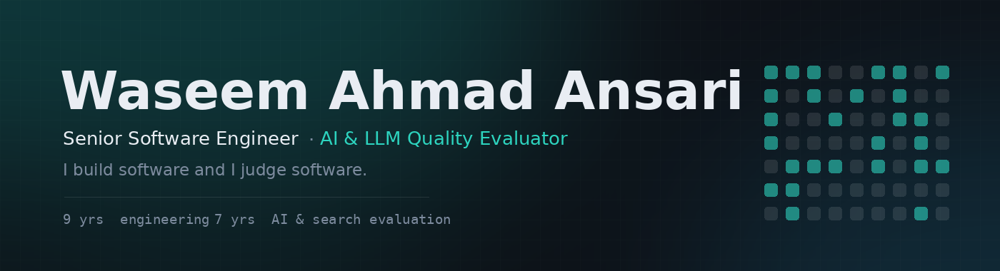

  
  
  

  Computer Engineer (B.E.) with nine years building software, web, and mobile applications, 
  and seven years evaluating the search and AI systems that shape what people find online.

  Based in Mumbai, India (IST) &nbsp;·&nbsp; +91 92703 04741

---

## What I do

I build software and I evaluate it. Knowing how a search stack or a language
model pipeline is put together makes for sharper judgement of what it produces —
and years of assessing that output against detailed guidelines make for more
careful engineering.

> **Engineering** — application development across desktop, web, and mobile;
> front-end and back-end integration; functional and non-functional QA; Agile
> delivery; mentoring and coding standards.

> **AI &amp; search evaluation** — RLHF response ranking and preference data; red
> teaming for unsafe and policy-violating output; hallucination and factuality
> checking; prompt engineering and SFT data authoring; search and ads relevance
> rating; multilingual evaluation and localization.

---

## Multiplayer games

Real-time games that run in a browser. No install, no account, no app store —
open a link, share the code, and play. All three are server-authoritative on
Cloudflare Workers with Durable Objects, so every player sees the same world and
a modified browser cannot cheat.

| Game | What it is | Built with |
|---|---|---|
| **[Chalk Runner](https://chalk-runner.waseemwdd0165.workers.dev/)** | Two players on a blackboard. One draws the ground, the other runs on it and never stops. Chalk runs out and only works near the runner, so the drawer is always one line behind. Walls, low roofs and no-chalk gaps force ramps and jumps, and everyone gets the same level each day. | Canvas · Web Audio · WebSockets · Durable Objects |
| **[Pitch Black](https://pitch-black.waseemwdd0165.workers.dev/)** | A stealth game played in the dark. One hunter, everyone else runs for the exit, and the caught join the hunt. Every device renders the same maze from its own torch, and the server sends each player only what their torch reaches — so the console gives nothing away. | Canvas · Raycasting · WebSockets · Durable Objects |
| **[Sunday Park](https://sunday-park.waseemwdd0165.workers.dev/)** | A voxel amusement park everybody shares. No room code: open the link and you are at the gate with whoever else is online. Ride the big wheel, the carousel and the swings, or get lost in the mirror maze. Rides are seat-synced from the server. | Three.js · WebSockets · Durable Objects |
| **[Human or Machine?](https://waseemwdd0165-jpg.github.io/human-or-machine.html)** | A room-code party game for 3 to 8. Everyone reads the same response and votes on whether a person or a model wrote it, then the reveal explains what gave it away. My day job, turned into a party game. | WebRTC, peer to peer — no server at all |

---

## Evaluation tools

Tools built out of seven years of rating work. Each one is a loop I actually
run, turned into something anyone can use.

### [rater-agreement](https://github.com/waseemwdd0165-jpg/rater-agreement) &nbsp;Python

The useful question about two raters is never *how much did they agree*. It is
*which boundary did they disagree on*. So this reports percent agreement,
Cohen's and Fleiss' kappa, and then points at the pair of labels they keep
mixing up and names every item they split on.

In the sample run, one rater sits at 75 to 80 percent on three labels and
**16.7 percent on the fourth** — she calls it by the neighbouring name almost
every time. That is not a careless rater, it is one sentence in the guideline.

No dependencies, standard library only, 30 tests with the kappa arithmetic
worked out by hand in the comments rather than computed by the code under test.

### Four browser tools

All run in the browser on sample data — no API key, no server.

| Project | What it demonstrates |
|---|---|
| **[LLM Response Evaluator](https://waseemwdd0165-jpg.github.io/llm-evaluator.html)** | Side-by-side rubric scoring, forced preference choice, gold-label agreement, JSONL export — the RLHF preference-data loop |
| **[Search Relevance Rater](https://waseemwdd0165-jpg.github.io/search-rater.html)** | Needs Met and Page Quality rating against written guidelines, keyboard-driven, CSV export |
| **[Prompt Testing Workbench](https://waseemwdd0165-jpg.github.io/prompt-workbench.html)** | Prompt versions run against a fixed test set with automated checks, including a prompt-injection case |
| **[Text Annotation Tool](https://waseemwdd0165-jpg.github.io/annotation-tool.html)** | Span labelling for NER data with live inter-annotator agreement against a gold standard |

---

## Tech stack

**Languages**

**Web &amp; frameworks**

**Databases**

-0d1117?style=flat&logo=oracle&logoColor=f80000)

**Tools**

---

## Experience

<table>
<tr><td width="230" valign="top">

**Senior Software Engineer**

Net Tech Services India Pvt. Ltd, Mumbai

*Jan 2017 – Mar 2025*

</td><td valign="top">

- Contributed to the nationwide Cheque Truncation System (CTS) rollout for core banking — a regulated, high-availability environment where a failed deployment stops branch operations
- Designed, built, and shipped applications, websites, and mobile apps for clients, from architecture through deployment
- Led front-end and back-end integration; ran functional and non-functional QA
- Mentored junior developers and helped set coding standards across the team

</td></tr>
<tr><td width="230" valign="top">

**AI &amp; LLM Quality Evaluator · Search Evaluator · Localization Analyst**

Freelance

*2018 – Present*

</td><td valign="top">

- Rank competing model responses to produce preference data behind RLHF, applying written rubrics consistently at volume
- Red-team models for unsafe, biased, and policy-violating output
- Check model claims against sources to catch hallucinations and fabricated citations
- Evaluate output across multiple languages; test chatbots and voice assistants
- Rate search results and digital ads against quality guidelines

</td></tr>
<tr><td width="230" valign="top">

**Support Executive Officer**

Net Tech Services India Pvt. Ltd

*2016*

</td><td valign="top">

- Tested core software products, functionally and for performance and reliability
- Supported application rollouts and contributed to UI development

</td></tr>
</table>

---

## Education

**B.E. Computer Engineering** — University of Mumbai, Rizvi College of Engineering
 Examination May 2015 · Convocation January 2017

---

  Open to full-time, contract, and freelance work. 
  Reach me at <a href="mailto:Waseemwdd0165@gmail.com">Waseemwdd0165@gmail.com</a>

